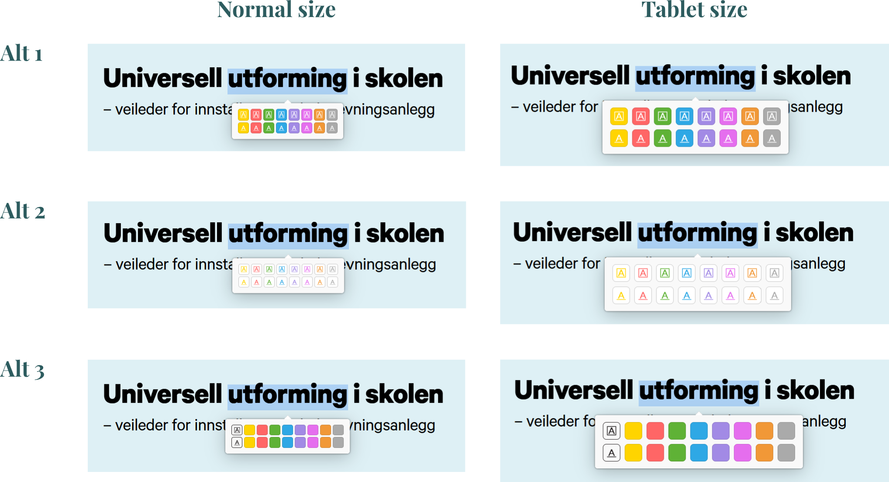

# Streamline Highlight Popup

A small Zotero plugin that merges **colour** and **style** into a single click in the reader's text selection popup.

Zotero's built-in popup puts the eight annotation colours in one row and the highlight/underline toggle in another. If you switch between highlighting and underlining depending on context, that split makes it easy to pick the right colour but leave the style toggle on whatever it was last set to — you notice only after the annotation is created.

This plugin replaces those two rows with **one row per style**: the top row creates highlights, the bottom row creates underlines, both with the same eight colours in the same order. Colour and style become a single decision.

## Layout options

Three visual treatments of the same idea, switchable in the preferences:

| | Description |
|---|---|
| **Alt 1** | Solid colour squares with a white icon |
| **Alt 2** | Light buttons with a coloured icon *(default)* |
| **Alt 3** | Plain colour squares, with one leading label icon per row |

Each is available at two button sizes — **Normal** (25 px, for mouse and trackpad) and **Tablet** (40 px with more spacing, for touch) — giving six combinations in total.

## How it works

Zotero exposes an official hook, `Zotero.Reader.registerEventListener('renderTextSelectionPopup', …)`, which lets plugins add DOM to the popup — but not replace the built-in rows. So the plugin hides the two original rows and renders its own grid on top. Clicking one of its swatches dispatches a real click on the hidden style toggle (if needed) and then on the hidden colour button.

This means **all actual annotation logic stays with Zotero**. The plugin never creates an annotation itself; it only orchestrates Zotero's own buttons. That keeps it small and reduces the chance of it corrupting anything — but it does depend on internal CSS class names, which is the main source of fragility (see [Caveats](#caveats)).

- **More info here:** [DEVELOPMENT.md](DEVELOPMENT.md)
- **Source code folder:** [addon](addon)

## Installation

Download the `.xpi` from **[releases](https://github.com/sstraume97/zotero-highlight-popup-ui-plugin/releases/latest)**, then in Zotero: **Tools → Add-ons → gear icon → Install Add-on From File…**

Configure it under **Edit → Settings → Highlight Popup**.

Requires Zotero 7 or later. Built and tested on Zotero 10.

## Background

I proposed this redesign on the Zotero forums: **[UI suggestion: streamline the highlight color/style popup in the PDF reader](https://forums.zotero.org/discussion/133371/ui-suggestion-streamline-the-highlight-color-style-popup-in-the-pdf-reader#latest)**

I'd be glad to see something like it land in Zotero itself — the team knows their design language far better than I do. This plugin exists so the idea can be *tried* rather than just described: a working proof of concept, and something I can use in the meantime in case the team decides to implement something similar one day (or not).

If you're from the Zotero team and want to take the idea further, please do — no attribution needed.

## Caveats

**Please read this before installing:**

- **This is the first working release.** It has been tested by exactly one person on one machine (Windows, Zotero 10). Expect bugs.
- **It was written with [Claude](https://claude.ai)**, Anthropic's AI assistant, based on my design sketches and testing feedback. I reviewed the result, but I'm not a JavaScript developer and can't vouch for every line.
- **It relies on internal class names** from the [zotero/reader](https://github.com/zotero/reader) source (`.colors`, `.color-button`, `.tool-toggle`, `.selection-popup`, and others). These are not a public, guaranteed API. A future Zotero release can rename them at any time, and the plugin will then stop working — most likely by simply doing nothing when you click a swatch, but conceivably in messier ways.
- **No warranty of any kind.** Use at your own risk. If your workflow depends on Zotero being reliable, consider testing this on a separate Zotero profile first. The plugin does not touch your library data directly, but that is a design intention, not a guarantee.

Bug reports and pull requests are welcome — though be aware that my capacity to maintain this is limited.

- **[Report bugs here](Issue-url)**
  

> [!NOTE]
> If you find this plugin useful and actually know your way around Zotero plugin development — unlike me — you are more than welcome to take the project over, fork it, or rebuild it properly from scratch. I'd genuinely prefer that outcome: the idea deserves an implementation written by someone who knows what they're doing.
> 
> All I ask is that you let me know, so I can switch to your version and point people there instead of maintaining a weaker parallel implementation.

## Licence

[MIT](LICENSE)
