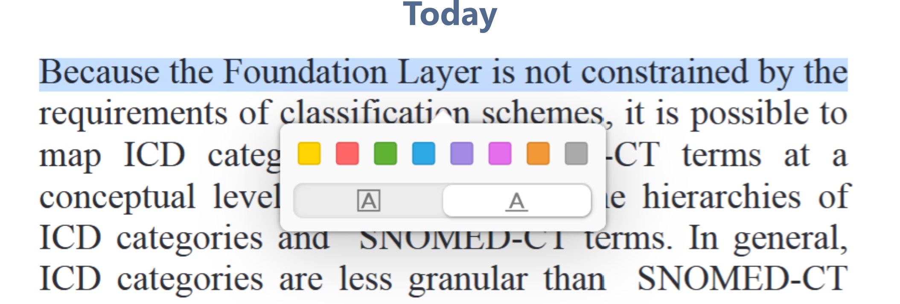
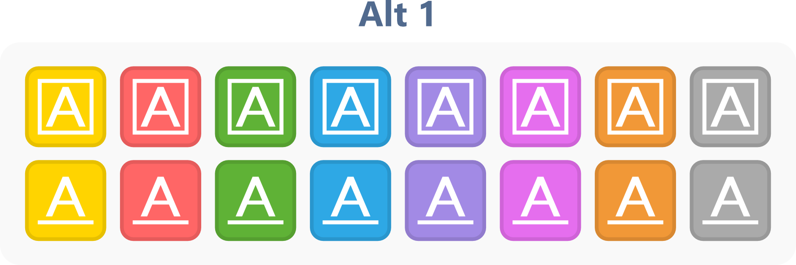
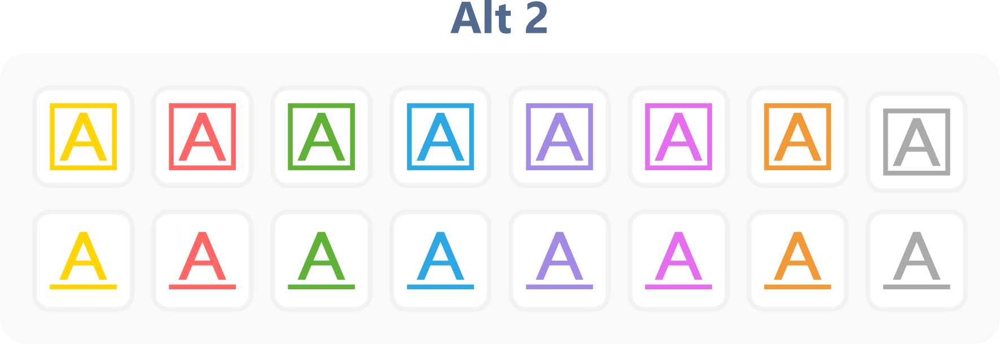
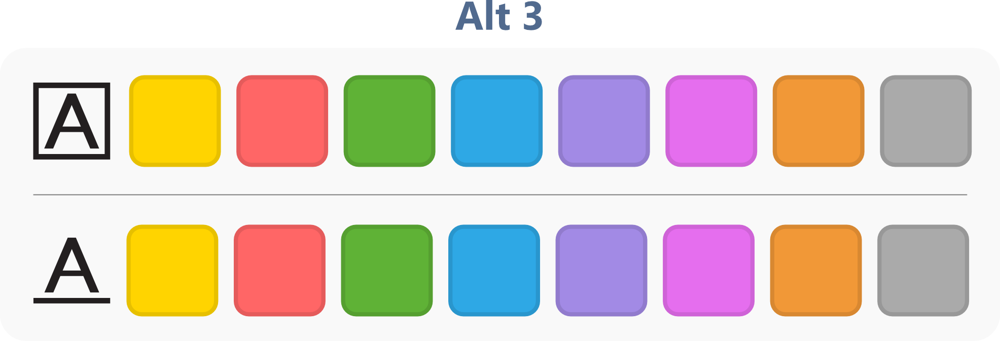

# UI suggestion: streamline the highlight color/style popup in the PDF reader

**Posted on Zotero forum:** https://forums.zotero.org/discussion/133371/ui-suggestion-streamline-the-highlight-color-style-popup-in-the-pdf-reader#latest

**Har utviklet et [popup ui plugin som du kan lese mer om her](popup-ui-plugin.md)

## Current behavior 

When you select text, the popup menu shows a row of 8 color swatches, and below that a separate row with two style toggles: highlight and underlined. 

## The problem
I regularly switch between underline and regular highlight depending on context, and I find it a bit fiddly to apply the right combination of color + style — color and style live in two separate rows, so it's easy to pick the right color but leave the style toggle on whatever it was set to before (or vice versa). To be clear, this is still noticeably smoother than most other PDF readers I've used — kudos to the team — but I think it could be even better. 

I mocked up three possible redesigns of the popup to fix this. All three try to make color and style a single decision instead of two. (PS: I'm not a UI designer, so I'm sure I'm breaking a few design principles in these mockups — take them as a starting point for the idea, not a finished proposal.) 

## Alt 1: Two full rows, one per style, solid color icons 

The single color row is split into two rows of 8 colored buttons each (same 8 colors, same order in both rows):

Top row: each swatch is a solid color square containing a white boxed "A" icon → applies that color as a highlight.

Bottom row: each swatch is a solid color square containing a white underlined "A" icon → applies that color as an underline.

Color and style are picked in a single click. 16 buttons total, but grouped clearly by row so it stays easy to scan. 

## Alt 2: Same two-row layout, lighter icon style 

Structurally identical to Alt 1 (8 colors × 2 style rows), but the buttons are visually lighter: instead of solid color fill, each swatch is a white/transparent button with a colored outline and a colored "A" icon (boxed for highlight, underlined for underline). Same one-click color+style selection as Alt 1, but less visually heavy/saturated — closer in weight to the current menu's style toggles. 

## Alt 3: Same two rows, plain swatches with one label icon per row 

Same structure and functionality as Alt 1/Alt 2: a highlight row and an underline row, 8 colors each, clicking a swatch applies that color in that row's style. The difference is purely visual — the swatches themselves are plain solid color squares with no icon inside, and each row instead has a single leading label icon (boxed "A" for the highlight row, underlined "A" for the underline row) showing what that row does. So it's not more compact than Alt 1/Alt 2 (still 8+8 buttons) — if anything it's slightly wider because of the leading label icon — just a different visual treatment. 

**My take:** all three solve the "wrong combination" problem the same way functionally; Alt 1 and Alt 2 mainly differ in how heavy/saturated the buttons look, and Alt 3 trades a repeated icon per swatch for one label per row. Curious what the team and other users think — happy to iterate on the mockups if there's interest.

